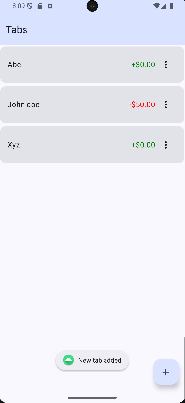
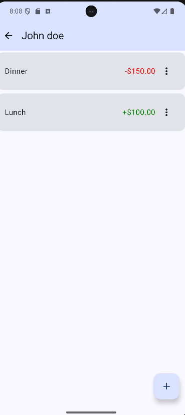
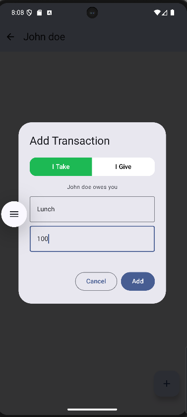

# TabZ 💸

TabZ is a simple yet powerful Android application designed to help you easily track shared expenses and tabs with friends, family, or colleagues. It provides a clean interface to manage who owes whom, with all data stored locally on your device for complete privacy.

This project is built using modern Android development practices with Kotlin and Jetpack Compose.

## ✨ Features

- **Create Multiple Tabs**: Easily create and manage separate tabs for different people or purposes.
- **Intuitive Transactions**: Add transactions using an intuitive "I Take" / "I Give" interface, eliminating the need to manually enter positive or negative numbers.
- **Persistent Storage**: All your data is saved locally on your device using the Room Database, so it persists even after you close the app.
- **Real-time Totals**: The total amount for each tab is automatically calculated and displayed on the main screen.
- **Edit & Share**: Delete individual transactions or entire tabs with user-friendly confirmation dialogs. Share transaction details with others.
- **Clean UI**: A modern, single-activity user interface built entirely with Jetpack Compose and Material 3 design principles.
- **Adaptive Icon**: A beautiful adaptive icon that looks great on all Android devices and launchers.

## 📸 Screenshots

Here’s a glimpse of what TabZ looks like.

| Tabs Screen | Transactions List | New Transaction Dialog |
| :---: | :---: | :---: |
|  |  |  |

## 🛠️ Technologies Used

This project leverages a full suite of modern Android development tools:

- **UI**: [Jetpack Compose](https://developer.android.com/jetpack/compose) with [Material 3](https://m3.material.io/).
- **Language**: [Kotlin](https://kotlinlang.org/).
- **Architecture**: MVVM (Model-View-ViewModel).
- **Asynchronicity**: [Kotlin Coroutines](https://kotlinlang.org/docs/coroutines-overview.html) and [Flow](https://developer.android.com/kotlin/flow) for managing background threads and reactive data streams.
- **Database**: [Room](https://developer.android.com/training/data-storage/room) for robust, local data persistence.
- **Lifecycle Management**: [Android ViewModel](https://developer.android.com/topic/libraries/architecture/viewmodel) to store and manage UI-related data in a lifecycle-conscious way.
- **Navigation**: [Compose Navigation](https://developer.android.com/jetpack/compose/navigation) for navigating between screens.

## 🔮 Future Improvements

TabZ is currently a great local transaction tracker. Here are some features that could be added in the future:

- **Cloud Sync**: Use a backend service like Firebase to sync tabs across multiple devices.
- **Group Tabs**: Allow tabs to be shared between more than two people for managing group expenses.
- **Reports & Analytics**: Generate simple reports or charts to visualize spending habits.
- **Transaction Categories**: Add categories (e.g., Food, Travel, Entertainment) to transactions.
